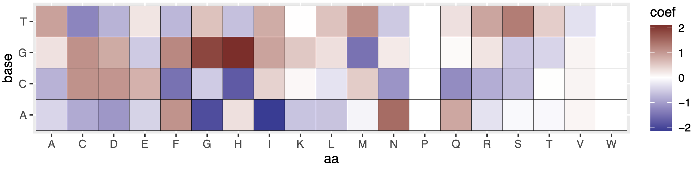

### Overview

rCLAMPS is software implementing a computational framework described in the manuscript:  "Learning probabilistic protein-DNA recognition codes from DNA-binding specificities using structural mappings" by Joshua Wetzel, Kaiqian Zhang, and Mona Singh.

Specifically, rCLAMPS (Recognition Code Learning via Automated Mapping of Structural interfaces) implements a Gibbs sampling approach to examine large-scale collections of position-specific weight matrices (PWMs) for transcription factors (TFs) of a given TF family in order to probabilistically infer:  1) A mapping of positions within each PWM to base positions within a canonical structural TF-DNA binding interface for the TF family, and 2) A TF family-wide "recognition code" relating amino acids occupying key base-contacting positions within the TFs to their preferrences for different bases occupying the binding site positions they contact.  So far, we have tested our software on the homoedomain TF family broadly, and also on a subset of Cys2-His2 zinc finger (C2H2-ZF) TFs for which it is known in advance which C2H2-ZF domains are contacting the binding sites represented within their PWMs.

### Using rCLAMPS to predict specificites for novel (or altered versions of) TFs:

We provide a template for how to do so in the the file **./code/predictionExample.py**.

#### For homeodomains:
1. Set **DOMAIN_TYPE = 'homeodomain'** in the file **predictionExamples_helpers.py**
2. Set **PROTEIN_FILE** to point to a fasta file wherein each protein sequence has a unique identifier and contains a single homeodomain (see, e.g.,  **./examplePredictions/homeodomain/predictionExamples.fa**)
3. Set **OUTPUT_DIR** to point to a desired output directory path

#### For C2H2-ZFs:
*Since C2H2-ZF TFs bind DNA via arrays of closely linked C2H2-ZF domains (see manuscript for details on the C2H2-ZF-DNA interface), we use a more precise input format than for the homeodomains.*
1. Set **DOMAIN_TYPE = 'zf-C2H2'** in the file **predictionExamples_helpers.py**
2. Set **PROTEIN_FILE** to point to a two column file containing, for each C2H2-ZF protein, the base-contacting residues of a linked array of C2H2-ZF domains.  Specifically, the first column of each line gives a unique protein identifier, and for each consecutive line for the same identifier, the second column gives the base-contacting residues of a C2H2-ZF domain within the linked array, in N-to-C terminal order (see, e.g.,  **./examplePredictions/zf-C2H2/predictionExamples.fa**).  These base-contacting residues correspond to positions -1, 2, 3, and 6 of the C2H2-ZF alpha-helix using the standard structural numbering scheme.  *We recommend finding C2H2-ZF domains within proteins using HMMer v.2.3.2, as it more accurately detects short domains (C2H2-ZFs are typically only 23 amino acids in length) than more recent versions of HMMer (i.e., version 3).  The code in **./cis_bp/C2H2-ZF/findDomains.py** and associated scripts demonstrate how we used HMMer v2.3.2 to find these positions within closely linked C2H2-ZF arrays, and make additional checks.*
5. Set **OUTPUT_DIR** to point to a desired output directory path

For each protein in **PROTEIN_FILE**, a predicted PWM in tabular format will be written into **OUTPUT_DIR/predicted_pwms.txt**.  If you have weblogo installed (see http://weblogo.threeplusone.com/manual.html#download), then you can set **MAKE_LOGOS = True** and each predicted logo will also be visualized and saved into **OUTPUT_DIR/predicted_logos/**.

### Exploring coefficients learned by rCLAMPS
Coefficients learned by rCLAMPS' recognition codes for the two TF families explored in the manuscript can be viewed either visually or via text files in the **./coefficientExplore/** directory.  These coeffients correspond to expected relative changes in the the log-odds of observing a particular base in a particular binding site positon given the observation of a particular amino acid in a particular protein position that contacts that binding site position.  For a few illustrative examples of the intepretations of these coefficients, we can look at **./coefficientExplore/zf-C2H2/coef_plots/coef_b2.a3.pdf** (shown below):  Here, we see that histidine (H) in alpha-helix position a3 more than doubles the log-odds of guanine in base position 2 (darkest red spot), relative to baseline.  Similarly, asparagine (N) in this same position increases the log-odds of observing adenine in base position 2 by about 1.5 above baseline.  Both of these examples reflect well-known favorable amino acid sidechain-to-base interactions for position b2 of the C2H2-ZF domain-DNA interface.  



*Note: Coefficients for tyrosine (Y) are absent because it was arbitrarily chosen as a reference amino acid for each protein-to-base contact position pair. Thats is, the effects of tyrosine on preference for each base in each position are absorbed into intercept terms.*

### Requirements
For a list of requirements to run rCLAMPS and/or **examplePredictions.py**, please see **requirements.txt**. If you wish to reproduce models examined in the manuscript, please see **modelReproductions.txt**.  

### Reproducing manuscript results
Additionally short script reproducing the main analysis plots reported in our main manuscript are located in **./code/analysis_manuscript.R**. and **analysis_manuscript_zf-C2H2.R**.  The in-code documentation there describes which additional code files were run to produce inputs the tables analysed in these scripts.

### Training your own recognition codes with rCLAMPS
If you wish to run the rCLAMPS framework itself to infer new recogntion codes or train with different datasets, the main file of interest is **./code/gibbsAlign_GLM.py** - it provides the following I/O functionalities:

#### Inputs:
1.  A protein-DNA interface contact map for the protein family of interest - I.e., positions within the DNA-binding domain that canonically interact with DNA bases, along with the corresponding DNA position indices that they tend to interact with (according to a canonical numbering scheme, based on the underlying multiple structural alignment).  See **./precomputedInputs/homeodomain_contactMap.txt** for an example.
2.  A set of protein-DNA binding specificities as PWMs, along with their corresponding protein sequences as a fasta file.  See **./precomputedInputs/pwmTab_homeodomains_all.txt** and **./precomputedInputs/proteins_homeodomains_hasPWM.fa** for examples. 
 

#### Outputs:
*The code in* **gibbsAlign_GLM.py** *outputs a pickle file containing a dictionary of Python list objects (each index in the list corresponds to one of K Gibbs sampling chains).  Each list contains:*
1.  'final_model':  A dictionary of scikit-learn LogisticRegression objects with multiclass='multinomial', one for each base position in the contact map, keyed by the base position.  Auxilliary functions needed to transform protein sequence inputs into the proper input format for the models and to make specificity predicitons for novel proteins are included in gibbsAlign_GLM.py.
2.  'll':  The log likelihood of the final model.
3.  'start':  A dictionary of start positions, keyed by the PWM name, of the protein-DNA interaction interface inferred by while estimating the final_model, assuing the PWMs are oriented in the direction given by 'rev'.
4.  'rev':  A dictionary of boolean values, keyed by the PWM name, of the PWM orientations inferred by while estimating the final_model.  0 is the original orientation, 1 is the reverse complement orientation.

For example, to extract the optimal model, starts, and orientations from the pickle file, one would use: 

```
with open(filename) as f:
 res = pickle.load(f)
score = [x['ll'] for x in res]   # Find the model/mapping with optimal likelihood
opt = np.argmax(score)           
start = [x['start'] for x in res][opt]  # Extract the set of PWM starting positions corresponding to this
rev = [x['rev'] for x in res][opt]      # Extract the set of PWM orientations corresponding to this
opt_models = [x['final_model'] for x in res][opt]  # Extract the optimal model object itself
```

#### Reuse and contact info
This code is feely available for reuse and modification, though we request that if you use it please reference the corresponsing manuscript.  Please refer any questions regarding the framework or software to jlwetzel@princeton.edu and/or mona@cs.princeton.edu.
